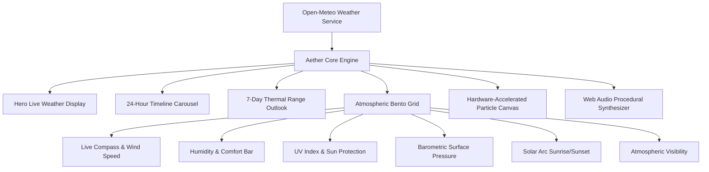

<div align="center">

  <br />
  
  
  # 🌤️ AETHER WEATHER
  ### *Real-Time Atmospheric Intelligence & Bioluminescent Design*

  <p align="center">
    A state-of-the-art, interactive atmospheric weather experience crafted with <b>Vanilla HTML5, CSS3, and modern ES6+ JavaScript</b>. Powered by the zero-configuration <b>Open-Meteo API</b> with real-time global forecasting, hardware-accelerated particle atmospheric effects, and generative procedural audio ambience.
  </p>

  <p align="center">
    <a href="https://github.com/Mobeen-2024/Weather-Layout/stargazers"></a>
    <a href="https://github.com/Mobeen-2024/Weather-Layout/network/members"></a>
    <a href="https://github.com/Mobeen-2024/Weather-Layout/blob/main/LICENSE"></a>
    <a href="https://open-meteo.com/"></a>
  </p>

  <p align="center">
    <a href="https://img.shields.io/badge/HTML5-E34F26?style=flat-square&logo=html5&logoColor=white"></a>
    <a href="https://img.shields.io/badge/CSS3-1572B6?style=flat-square&logo=css3&logoColor=white"></a>
    <a href="https://img.shields.io/badge/JavaScript-F7DF1E?style=flat-square&logo=javascript&logoColor=black"></a>
    <a href="https://img.shields.io/badge/Web_Audio-Synthesizer-8b5cf6?style=flat-square"></a>
    <a href="https://img.shields.io/badge/Responsive-Mobile_First-34d399?style=flat-square"></a>
  </p>

  <br />

  ---

  <br />
</div>

## 🌌 Key Highlights & Features

<div align="center">

| Feature | Description | Highlight |
| :--- | :--- | :---: |
| ⚡ **Zero-Config Live Data** | Powered by Open-Meteo without requiring API keys or signups. | `Global & Free` |
| 🔍 **Live Autocomplete Search** | Debounced instant geocoding across worldwide cities & regions. | `Flag Emojis & Coords` |
| 📍 **GPS Geolocation** | One-click "Near Me" instant location & reverse-geocoding. | `High Precision` |
| 🎨 **Aether Glass Aesthetic** | Frosted glassmorphism (`backdrop-filter: blur(24px)`) & reactive themes. | `Nordic Precision` |
| 🌧️ **Dynamic Atmosphere Engine** | Fullscreen 2D canvas rendering rain, snow, sun motes, stars & lightning. | `60 FPS Hardware-Accel` |
| 🎵 **Generative Audio Ambience** | Built-in procedural pink-noise synthesizer simulating rain & wind. | `Zero External Audio` |
| ⏱️ **24-Hour Timeline** | Hourly breakdown of temps, conditions & precipitation probability. | `Interactive Carousel` |
| 📅 **7-Day Extended Forecast** | Apple-style forecast with dynamic temperature gradient range bars. | `Visual Thermal Spread` |
| 🧭 **Atmospheric Bento Metrics** | Rotating compass dial, humidity gauge, UV scale, barometric trend & sun arc. | `Complete Telemetry` |
| 🔄 **Unit Converter** | Instant toggle between Celsius (°C) and Fahrenheit (°F). | `LocalStorage Cache` |

</div>

<br />

---

## 🎛️ Atmospheric Bento Telemetry

<div align="center">



</div>

<br />

---

## 🚀 Quick Start Guide

You don't need to install any heavy packages or build tools! Aether Weather runs right out of the box in any modern browser.

### Option 1: Direct File Opening
Double-click [`index.html`](index.html) or drag it into any web browser.

### Option 2: Local HTTP Server (Recommended)

Using **Python**:
```bash
# Python 3
python -m http.server 8080
```
Then visit **`http://localhost:8080`** in your browser.

Using **Node.js**:
```bash
npx serve .
```

---

## 🌐 One-Click GitHub Pages Deployment

Host your weather app for free on GitHub Pages:

1. **Commit & Push** your changes:
   ```bash
   git add .
   git commit -m "feat: upgrade to modern Aether Weather layout"
   git push origin main
   ```
2. In your GitHub repository:
   - Go to **Settings** > **Pages**.
   - Under **Build and deployment**, set the source to **Deploy from a branch**.
   - Choose the `main` branch and `/ (root)` directory, then click **Save**.
3. Your app is now live worldwide! 🎉

---

## 💻 Tech Stack Architecture

<div align="center">

| Layer | Technology | Purpose |
| :--- | :--- | :--- |
| **Structure** | Semantic HTML5 | Clean accessibility landmarks (`main`, `section`, `article`, `header`, `nav`) |
| **Styling** | Vanilla CSS3 | Modern design tokens, glassmorphic filters, CSS Grid bento layout, keyframe animations |
| **Typography** | Google Fonts | *Plus Jakarta Sans* for architectural clarity & *Space Grotesk* for metrics |
| **Logic** | ES6+ JavaScript | Debounced search, reactive state management, unit conversion, live clock sync |
| **Audio** | Web Audio API | Procedural biquad-filtered noise generation for soothing ambient sound |
| **Graphics** | HTML5 Canvas 2D | Real-time particle physics simulating atmospheric precipitation & stars |
| **Data** | [Open-Meteo](https://open-meteo.com/) | High-accuracy global meteorological and geocoding endpoints |

</div>

<br />

---

## ⌨️ Keyboard Shortcuts

<div align="center">

| Key | Action |
| :---: | :--- |
| <kbd>/</kbd> | Instantly focus the city search bar |
| <kbd>Esc</kbd> | Close autocomplete search suggestions |
| <kbd>Enter</kbd> | Submit city search query |

</div>

---

## 📄 License

<div align="center">

This project is licensed under the **[MIT License](LICENSE)**.

You are free to use, modify, distribute, and build upon this project for both personal and commercial purposes.

</div>

<br />

---

<div align="center">

  ### Crafted with ❤️ & Modern Craftsmanship
  
  If you find this project helpful or inspiring, give it a ⭐ on GitHub!

  [Report a Bug](https://github.com/Mobeen-2024/Weather-Layout/issues) • [Request a Feature](https://github.com/Mobeen-2024/Weather-Layout/issues) • [Fork Repository](https://github.com/Mobeen-2024/Weather-Layout/fork)

  <br />
  
  <sub>Released under the **MIT License** • Built for performance, beauty, and simplicity.</sub>

</div>
